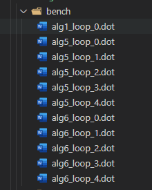
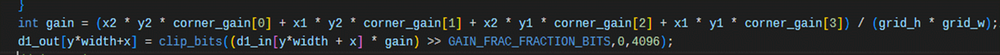

# **CGRA Compiler**

把benchmark生成.bc，然后放在test里面的test/dfg/src下，根据这个bc文件，以及dfg模块生成的可执行文件dfg.out，将bc文件转换成dfg图，这个output会被放在test/dfg/output里面。然后test/dfg/output会和test/dfg/bench对比，校验功能是否正确。


# 沈工调试

将terminal输出生成log：

```
1>log 2>&1 //在原来的命令基础上增加这个
```


```
sudo apt update // 更新全部软件
如果安装失败
sudo apt-get update //更新一下源
```


## 无法调试：

使用g++编译dfg.out

g++版本太老，更新新的版本

```bash
apt search g++

sudo apt-get install g++-13

```

更新：


## 生成llvm IR

```
llvm-dis ./test/dfg/src/alg1.bc -o alg1.ll
```


## 未解决的问题：

1.链接：编译dfg.out时的链接问题：现在链接了下面这么多没用到的文件，实际上很多都没有用

>  -L/home/luguangyang/clang+llvm-15.0.5-x86_64-linux-gnu-ubuntu-18.04/lib/ -lLLVMWindowsManifest -lLLVMWindowsDriver -lLLVMXRay -lLLVMLibDriver -lLLVMDlltoolDriver -lLLVMCoverage -lLLVMLineEditor -lLLVMXCoreDisassembler -lLLVMXCoreCodeGen -lLLVMXCoreDesc -lLLVMXCoreInfo -lLLVMX86TargetMCA -lLLVMX86Disassembler -lLLVMX86AsmParser -lLLVMX86CodeGen -lLLVMX86Desc -lLLVMX86Info -lLLVMWebAssemblyDisassembler -lLLVMWebAssemblyAsmParser -lLLVMWebAssemblyCodeGen -lLLVMWebAssemblyDesc -lLLVMWebAssemblyUtils -lLLVMWebAssemblyInfo -lLLVMVEDisassembler -lLLVMVEAsmParser -lLLVMVECodeGen -lLLVMVEDesc -lLLVMVEInfo -lLLVMSystemZDisassembler -lLLVMSystemZAsmParser -lLLVMSystemZCodeGen -lLLVMSystemZDesc -lLLVMSystemZInfo -lLLVMSparcDisassembler -lLLVMSparcAsmParser -lLLVMSparcCodeGen -lLLVMSparcDesc -lLLVMSparcInfo -lLLVMRISCVDisassembler -lLLVMRISCVAsmParser -lLLVMRISCVCodeGen -lLLVMRISCVDesc -lLLVMRISCVInfo -lLLVMPowerPCDisassembler -lLLVMPowerPCAsmParser -lLLVMPowerPCCodeGen -lLLVMPowerPCDesc -lLLVMPowerPCInfo -lLLVMNVPTXCodeGen -lLLVMNVPTXDesc -lLLVMNVPTXInfo -lLLVMMSP430Disassembler -lLLVMMSP430AsmParser -lLLVMMSP430CodeGen -lLLVMMSP430Desc -lLLVMMSP430Info -lLLVMMipsDisassembler -lLLVMMipsAsmParser -lLLVMMipsCodeGen -lLLVMMipsDesc -lLLVMMipsInfo -lLLVMLanaiDisassembler -lLLVMLanaiCodeGen -lLLVMLanaiAsmParser -lLLVMLanaiDesc -lLLVMLanaiInfo -lLLVMHexagonDisassembler -lLLVMHexagonCodeGen -lLLVMHexagonAsmParser -lLLVMHexagonDesc -lLLVMHexagonInfo -lLLVMBPFDisassembler -lLLVMBPFAsmParser -lLLVMBPFCodeGen -lLLVMBPFDesc -lLLVMBPFInfo -lLLVMAVRDisassembler -lLLVMAVRAsmParser -lLLVMAVRCodeGen -lLLVMAVRDesc -lLLVMAVRInfo -lLLVMARMDisassembler -lLLVMARMAsmParser -lLLVMARMCodeGen -lLLVMARMDesc -lLLVMARMUtils -lLLVMARMInfo -lLLVMAMDGPUTargetMCA -lLLVMAMDGPUDisassembler -lLLVMAMDGPUAsmParser -lLLVMAMDGPUCodeGen -lLLVMAMDGPUDesc -lLLVMAMDGPUUtils -lLLVMAMDGPUInfo -lLLVMAArch64Disassembler -lLLVMAArch64AsmParser -lLLVMAArch64CodeGen -lLLVMAArch64Desc -lLLVMAArch64Utils -lLLVMAArch64Info -lLLVMOrcJIT -lLLVMMCJIT -lLLVMJITLink -lLLVMInterpreter -lLLVMExecutionEngine -lLLVMRuntimeDyld -lLLVMOrcTargetProcess -lLLVMOrcShared -lLLVMDWP -lLLVMDebugInfoGSYM -lLLVMOption -lLLVMObjectYAML -lLLVMObjCopy -lLLVMMCA -lLLVMMCDisassembler -lLLVMLTO -lLLVMCFGuard -lLLVMFrontendOpenACC -lLLVMExtensions -lPolly -lPollyISL -lLLVMPasses -lLLVMObjCARCOpts -lLLVMCoroutines -lLLVMipo -lLLVMInstrumentation -lLLVMVectorize -lLLVMLinker -lLLVMFrontendOpenMP -lLLVMDWARFLinker -lLLVMGlobalISel -lLLVMMIRParser -lLLVMAsmPrinter -lLLVMSelectionDAG -lLLVMCodeGen -lLLVMIRReader -lLLVMAsmParser -lLLVMInterfaceStub -lLLVMFileCheck -lLLVMFuzzMutate -lLLVMTarget -lLLVMScalarOpts -lLLVMInstCombine -lLLVMAggressiveInstCombine -lLLVMTransformUtils -lLLVMBitWriter -lLLVMAnalysis -lLLVMProfileData -lLLVMSymbolize -lLLVMDebugInfoPDB -lLLVMDebugInfoMSF -lLLVMDebugInfoDWARF -lLLVMObject -lLLVMTextAPI -lLLVMMCParser -lLLVMMC -lLLVMDebugInfoCodeView -lLLVMBitReader -lLLVMFuzzerCLI -lLLVMCore -lLLVMRemarks -lLLVMBitstreamReader -lLLVMBinaryFormat -lLLVMTableGen -lLLVMSupport -lLLVMDemangle

2.警告：编译dfg.out时的两个警告

> ```
> /usr/bin/ld: warning: /usr/lib/gcc/x86_64-linux-gnu/7/libstdc++.so: unsupported GNU_PROPERTY_TYPE (5) type: 0xc0010001
> /usr/bin/ld: warning: /usr/lib/gcc/x86_64-linux-gnu/7/libstdc++.so: unsupported GNU_PROPERTY_TYPE (5) type: 0xc0010002
> ```
>
> 


# Benchmark优化

## 任务

共有8个benchmark（0-7），已实现benchmark1、5、6。

benchmark的问题

* 循环嵌套

* 循环里面有函数

* 循环节点太多

一个取余数，一个取取余之外的且不等于0

要求：

> 60个节点以内
>
>  100个的可能跑不完
>
> 1分钟


## .bc文件生成

运行这个`CGRA/src/assembler/makefile`，benchmark都在`/CGRA/src/assembler/self_tests`下。

目前的makefile只是针对alg7生成bc，如果需要生成别的，需要改好几个数字，把alg7换成algx，后续进行更新。

```makefile
CFLAGS = -I/usr/include/x86_64-linux-gnu -I/usr/include/i386-linux-gnu -I/usr/include/x86_64-linux-gnu/c++/7 -I/usr/include/c++/7

alg7.bc: ./self_tests/src_huawei/alg7.cpp
	clang -emit-llvm -c './self_tests/src_huawei/alg7.cpp' $(CFLAGS) -o '../../test/dfg/src/alg7.bc' -O3  -fno-vectorize -fno-slp-vectorize -fno-unroll-loops -m32

```

* 问题：这里的include头文件都是g++的，这里include的路径都是usr下的，而llvm放在了home下。

  * 解答：**在环境变量PATH里面已经设置了**，所以可以调用（因为**用的clang**，所以直接就去了llvm路径下调用）。

    ```
    which clang
    /home/luguangyang/clang+llvm-15.0.5-x86_64-linux-gnu-ubuntu-18.04/bin/clang
    ```

  ​        可以看到，这里是正确调用了，所以是可以生成llvm的bc

##### 优化之后的makefile：

```makefile
#CFLAGS = -I/usr/include/x86_64-linux-gnu -I/usr/include/i386-linux-gnu -I/usr/include/x86_64-linux-gnu/c++/7 -I/usr/include/c++/7         #apt安装完llvm-16版本之后可以不需要再用这个了，以及在环境变量了。

## 生成bc的脚本
%.bc: ./self_tests/src_huawei/%.cpp
	clang++ -emit-llvm -c '$^' $(CFLAGS) -o '../../test/dfg/src/$@' -O3  -fno-vectorize -fno-slp-vectorize -fno-unroll-loops -m32
# $@ 为目标名称   @^ 先决条件
```


## 生成dot文件



测试成功的bc都会生成一个dot文件，每个cpp里面的一个for循环都会生成一个dot


## 测试

运行正确的示例：

```shell
make -C ./src/mapper/ -j8 mapper.out      
make[1]: Entering directory '/home/luguangyang/CGRA/src/mapper'
make[1]: 'mapper.out' is up to date.
make[1]: Leaving directory '/home/luguangyang/CGRA/src/mapper'
make -C ./src/dfg/ -j6 dfg.out
make[1]: Entering directory '/home/luguangyang/CGRA/src/dfg'
make[1]: 'dfg.out' is up to date.
make[1]: Leaving directory '/home/luguangyang/CGRA/src/dfg'
python3 ./test/dfg/run_test.py
../../src/dfg/dfg.out -o "./output/alg6" ./src/alg6.bc
Loop at depth 1 containing: %131<header>,%141,%137,%134,%144,%148<latch><exiting>
Loop at depth 1 containing: %71<header><latch><exiting>
Loop at depth 1 containing: %95<header><latch><exiting>
Loop at depth 1 containing: %37<header><latch><exiting>
Loop at depth 1 containing: %4<header><latch><exiting>
../../src/dfg/dfg.out -o "./output/alg5" ./src/alg5.bc
Loop at depth 1 containing: %136<header>,%150,%173<latch><exiting>
Loop at depth 1 containing: %103<header>,%117,%132<latch><exiting>
Loop at depth 1 containing: %63<header>,%77,%100<latch><exiting>
Loop at depth 1 containing: %35<header>,%52,%54,%60<latch><exiting>
Loop at depth 1 containing: %7<header>,%23,%26,%32<latch><exiting>
../../src/dfg/dfg.out -o "./output/alg7" ./src/alg7.bc
Loop at depth 1 containing: %4<header>,%22,%69<latch><exiting>
../../src/dfg/dfg.out -o "./output/alg1" ./src/alg1.bc
Loop at depth 1 containing: %4<header><latch><exiting>
alg6_loop_1.dot: PASSED
alg5_loop_3.dot: PASSED
alg5_loop_2.dot: PASSED
alg5_loop_1.dot: PASSED
alg6_loop_0.dot: PASSED
alg1_loop_0.dot: PASSED
alg6_loop_3.dot: PASSED
alg5_loop_0.dot: PASSED
alg5_loop_4.dot: PASSED
alg6_loop_4.dot: PASSED
alg6_loop_2.dot: PASSED
python3 ./test/mapper/run_test.py
alg5_loop_0.map.map: PASSED
alg6_loop_0.asm: PASSED
TASK A_new.map.map: PASSED
alg5_loop_3.asm: PASSED
alg6_loop_4.asm: PASSED
lr_rout_test_2.map.map: PASSED
TASK D_1.asm: PASSED
alg5_loop_1.asm: PASSED
TASK D_new.asm: PASSED
alg6_loop_3.asm: PASSED
lr_rout_test_1.map.map: PASSED
alg5_loop_0.asm: PASSED
alg5_loop_4.map.map: PASSED
TASK D_1.map.map: PASSED
alg6_loop_4.map.map: PASSED
alg6_loop_1.asm: PASSED
TASK D_2.asm: PASSED
alg5_loop_2.asm: PASSED
lr_rout_test_2.asm: PASSED
alg6_loop_2.map.map: PASSED
TASK A_no_rout.map.map: PASSED
TASK A_new.asm: PASSED
alg5_loop_4.asm: PASSED
lr_rout_test_1.asm: PASSED
alg6_loop_1.map.map: PASSED
TASK D_2.map.map: PASSED
TASK A_no_rout.asm: PASSED
alg6_loop_3.map.map: PASSED
alg1_loop_0.asm: PASSED
alg6_loop_2.asm: PASSED
alg5_loop_1.map.map: PASSED
alg5_loop_3.map.map: PASSED
alg6_loop_0.map.map: PASSED
alg1_loop_0.map.map: PASSED
alg5_loop_2.map.map: PASSED
TASK D_new.map.map: PASSED
```


## 代码优化

### alg5.cpp

源代码为两层的for循环，分别使用row-index和col-index

```c++
for(int RowIdx=0; RowIdx<ALG5_HEIGHT; RowIdx++) {
        for(int ColIdx=0; ColIdx<ALG5_WIDTH; ColIdx++) {
            int RowPos = RowIdx / 2;
            int ColPos = ColIdx / 2;
```

将其拆分为一个for循环，使用一个 i 变量，

```c++
for (int i = 0; i < ALG5_HEIGHT * ALG5_WIDTH; i++) {
        if (i % ALG5_WIDTH == 0) {
            RowIdx++; // CGRA 无法使用除法
        }
        int ColIdx = i % ALG5_WIDTH;
        int RowPos = RowIdx / 2;
        int ColPos = ColIdx / 2;
```

如果拆完之后的一个for循环太大，可以将内部的操作进一步拆分到几个for循环中。详见alg6.cpp的例子

<u>**这种优化方法的主要目的是通过分离计算步骤来减少每次循环迭代中的复杂度，从而提高编译器的优化效果。**</u>

* **减少每次循环的复杂度**：
  - 原始代码在一个循环中执行所有计算步骤，包含提取数据、线性变换、调整数据和剪裁数据。这样每次循环迭代的复杂度较高，增加了编译器优化的难度。
  - 优化后的代码将这些操作分解为多个循环，每个循环只执行一部分计算。这样每次循环迭代的复杂度降低，编译器可以更好地进行优化。
* **提高数据局部性**：
  - 在原始代码中，数据的读取和写入分布在每次迭代中，可能导致数据局部性较差。
  - 优化后的代码在每个循环中处理不同的通道数据，提高了数据局部性，减少了缓存失效的可能性。
* **利用编译器优化**：
  - 分离计算步骤后，每个循环的逻辑更为简单，编译器可以更容易地识别和应用优化技术，如循环展开、指令并行等。


### alg6.cpp

```c++
ext_d3[0] = (in_d2[0] * tran_mat[0] + in_d2[1] * tran_mat[1] + in_d2[2] * tran_mat[2]+64) >> 7;//最后的结果除以128，其中加上64实现对结果的四舍五入
```


拆分循环：

基本的两层for循环的拆分思路与之前一样。

这里还有一些调优，是把大的for循环继续拆分：比如下面这个，一个for循环内部就计算了3个/4个最终量

```c++
for (int i = 0; i < iHeight * iWidth; i++)
	{
		if (i % iWidth == 0 && i != 0) {	
            y++;
        }
        x = i % iWidth;

        int in_d2[3];         
        int ext_d3[3];         
		// 逻辑是从 d2_in 中提取三通道数据，通过一个转换矩阵 tran_mat 进行线性变换，生成新的 d3_1、d3_2 和 d3_3 数据。
        in_d2[0] = d2_in[y][x][0];	//这里是每个通道下，逐像素处理，所以这里还是需要放在循环体内
        in_d2[1] = d2_in[y][x][1];
        in_d2[2] = d2_in[y][x][2];
		// 线性变换
        ext_d3[0] = (in_d2[0] * tran_mat[0] + in_d2[1] * tran_mat[1] + in_d2[2] * tran_mat[2]+64) >> 7;//最后的结果除以128，其中加上64实现对结果的四舍五入
        ext_d3[1] = (in_d2[0] * tran_mat[3] + in_d2[1] * tran_mat[4] + in_d2[2] * tran_mat[5]+64) >> 7;//应该是因为tran mat的大小限制在128内
        ext_d3[2] = (in_d2[0] * tran_mat[6] + in_d2[1] * tran_mat[7] + in_d2[2] * tran_mat[8]+64) >> 7;
        // 数据调整
		ext_d3[0] = ext_d3[0];   // 
        ext_d3[1] = ext_d3[1] + (128 << 2);     // (128 << 2) 等价于 128 * 2^2，也就是 128 * 4，结果是 512。
        ext_d3[2] = ext_d3[2] + (128 << 2);     // （1）增加偏移量可以将数据调整到一个适合的范围。例如，如果转换后的数据需要在一个非负的范围内，增加一个常数偏移量可以确保数据不会出现负值。（2）在某些颜色空间转换（例如 RGB 转 YCbCr 或者类似的颜色空间转换）中，转换后的某些通道需要增加一个偏移量，以确保其值在某个范围内。例如，在 YCbCr 颜色空间中，Cr 和 Cb 通常会有一个偏移量，使其中心值在中间，而不是在 0。
        // 数据剪裁
		d3_1[iWidth*y + x] = clip_bits(ext_d3[0], 0, 1023);
        d4_dst[iWidth*y + x] = d3_1[iWidth*y + x];	//用于存储中间处理结果的数组。但在当前的代码片段中没有看到 d4_dst 的进一步使用
        d3_2[iWidth*y + x] = clip_bits(ext_d3[1], 0, 1023);
        d3_3[iWidth*y + x] = clip_bits(ext_d3[2], 0, 1023);
	}
```

那么对其进行拆分：d3_1和d4_dst在一个for循环中，d3_2和d3_3各一个for循环

```c++
	int iHeight = ALG6_HEIGHT;
	int iWidth = ALG6_WIDTH;
	int tran_mat[9] = { 38,75,15,-22,-42,64,64,-54,-10 };
    int x = 0, y = 0;
	for (int i = 0; i < iHeight * iWidth; i++)
	{
		if (i % iWidth == 0 && i != 0) {
            y++;
        }
        x = i % iWidth;

        int in_d2[3];         
        int ext_d3[3];         
        in_d2[0] = d2_in[y][x][0];
        in_d2[1] = d2_in[y][x][1];
        in_d2[2] = d2_in[y][x][2];
        ext_d3[0] = (in_d2[0] * tran_mat[0] + in_d2[1] * tran_mat[1] + in_d2[2] * tran_mat[2]+64) >> 7;
        d3_1[iWidth*y + x] = clip_bits(ext_d3[0], 0, 1023);
        d4_dst[iWidth*y + x] = d3_1[iWidth*y + x];
	}
    x = 0, y = 0;
	for (int i = 0; i < iHeight * iWidth; i++)
	{
		if (i % iWidth == 0 && i != 0) {
            y++;
        }
        x = i % iWidth;

        int in_d2[3];         
        int ext_d3[3];         
        in_d2[0] = d2_in[y][x][0];
        in_d2[1] = d2_in[y][x][1];
        in_d2[2] = d2_in[y][x][2];
        ext_d3[1] = (in_d2[0] * tran_mat[3] + in_d2[1] * tran_mat[4] + in_d2[2] * tran_mat[5]+64) >> 7;
        ext_d3[1] = ext_d3[1] + (128 << 2);
        d3_2[iWidth*y + x] = clip_bits(ext_d3[1], 0, 1023);
	}
    x = 0, y = 0;
	for (int i = 0; i < iHeight * iWidth; i++)
	{
		if (i % iWidth == 0 && i != 0) {
            y++;
        }
        x = i % iWidth;

        int in_d2[3];         
        int ext_d3[3];         
        in_d2[0] = d2_in[y][x][0];
        in_d2[1] = d2_in[y][x][1];
        in_d2[2] = d2_in[y][x][2];
        ext_d3[2] = (in_d2[0] * tran_mat[6] + in_d2[1] * tran_mat[7] + in_d2[2] * tran_mat[8]+64) >> 7;
        ext_d3[2] = ext_d3[2] + (128 << 2);     // 
        d3_3[iWidth*y + x] = clip_bits(ext_d3[2], 0, 1023);
	}
```


### alg0.cpp

 三层for循环


> 这个计算公式是双线性插值算法（Bilinear Interpolation）的具体实现。双线性插值是一种在二维空间中进行插值的方法，它通过对相邻四个点的加权平均值进行计算，从而得到目标点的值。
>
> ### 双线性插值原理
>
> 假设我们有一个二维网格，其中已知四个顶点的值，我们希望通过这四个顶点的值来估计网格内部某一点的值。四个顶点分别为：
>
> - Q11Q_{11}Q11 (左上角)
> - Q21Q_{21}Q21 (右上角)
> - Q12Q_{12}Q12 (左下角)
> - Q22Q_{22}Q22 (右下角)
>
> 这些点的坐标和其增益值为：
>
> - 
>
> 双线性插值公式如下：
>
> - 
>
> ### 代码中的具体实现
>
> 在代码中，对每个像素点的增益值进行双线性插值计算，并以网格的左上角顶点为基准进行加权平均。具体实现如下：
>
> ```c
> int gain = (x2 * y2 * corner_gain[0] + x1 * y2 * corner_gain[1] + x2 * y1 * corner_gain[2] + x1 * y1 * corner_gain[3]) / (grid_h * grid_w);
> ```
>
> - 
>
> 从而计算得到：
>
> $
> gain = \frac{(x_2 - x)(y_2 - y) \cdot corner\_gain[0] + (x - x_1)(y_2 - y) \cdot corner\_gain[1] + (x_2 - x)(y - y_1) \cdot corner\_gain[2] + (x - x_1)(y - y_1) \cdot corner\_gain[3]}{(x_2 - x_1)(y_2 - y_1)}
> $
>
> 这就是代码中插值计算公式的来源，它能够有效地利用相邻四个顶点的增益值来估计目标点的增益值。


这里很难再次进行拆分了：

```c++
//正式循环
	int x = 0,y = 0;
	for (int k = 0; k < height*width; k++)
	{		
		if(k % width == 0 && k != 0) {
			y++;
		}
		x = k % width;

		int x_idx = 0;
		int x1 = 0, x2 = 0;
		for (int i = 1; i < GAIN_LUT_X_NUM; i++)
		{
			if (x <= gain_pos_x[i])		// 当找到第一个 x 小于或等于 gain_pos_x[i] 的位置时，确定它的左侧增益位置为 gain_pos_x[i - 1] 和右侧增益位置为 gain_pos_x[i]。
			{							//这个结构旨在找到当前像素 x 所在的区间，以便进行双线性插值。使用 <= 确保任何 x 值都能找到一个区间，而不是仅仅匹配具体的 gain_pos_x[i] 值。
				x_idx = i - 1;	// 如果 x 小于等于 gain_pos_x[i]，则找到对应的 x_idx。
				x1 = x - gain_pos_x[x_idx];		// x1 是当前像素到左侧增益位置的距离。
				x2 = gain_pos_x[x_idx + 1] - x; // x2 是当前像素到右侧增益位置的距离。
				break;	//直到计算出 最后一个 <= 的条件，也就是最大的一个 满足<=的，
			}
		}
		int y_idx = 0;
		int y1 = 0, y2 = 0;
		for (int i = 1; i < GAIN_LUT_Y_NUM; i++)
		{
			if (y <= gain_pos_y[i])
			{
				y_idx = i - 1;
				y1 = y - gain_pos_y[y_idx];
				y2 = gain_pos_y[y_idx + 1] - y;
				break;
			}
		}

		//计算当前像素所在网格的宽度 grid_w 和高度 grid_h。
		//上述中间量传给加法PE得到grid
		int grid_w = x1 + x2;
		int grid_h = y1 + y2;
		int corner_gain[4] = {0};

		if (y % 2 == 0 && x % 2 == 0) 	// x y均偶，取gain 1。！！！gain在mem按正方形排布还是15，16，25，26排布。
		{	
			corner_gain[0] = gain1[y_idx][x_idx];
			corner_gain[1] = gain1[y_idx][x_idx + 1];
			corner_gain[2] = gain1[y_idx + 1][x_idx];
			corner_gain[3] = gain1[y_idx + 1][x_idx + 1];
		}
		else if (y % 2 == 0 && x % 2 == 1) 	//x奇y偶，取gain2。
		{
			corner_gain[0] = gain2[y_idx][x_idx];
			corner_gain[1] = gain2[y_idx][x_idx + 1];
			corner_gain[2] = gain2[y_idx + 1][x_idx];
			corner_gain[3] = gain2[y_idx + 1][x_idx + 1];
		}
		else if (y % 2 == 1 && x % 2 == 0) 	//x偶y奇，取gain2
		{
			corner_gain[0] = gain2[y_idx][x_idx];
			corner_gain[1] = gain2[y_idx][x_idx + 1];
			corner_gain[2] = gain2[y_idx + 1][x_idx];
			corner_gain[3] = gain2[y_idx + 1][x_idx + 1];
		}
		else 
		{
			corner_gain[0] = gain3[y_idx][x_idx];
			corner_gain[1] = gain3[y_idx][x_idx + 1];
			corner_gain[2] = gain3[y_idx + 1][x_idx];
			corner_gain[3] = gain3[y_idx + 1][x_idx + 1];
		}

		int gain = (x2 * y2 * corner_gain[0] + x1 * y2 * corner_gain[1] + x2 * y1 * corner_gain[2] + x1 * y1 * corner_gain[3]) / (grid_h * grid_w);//双线性插值算法的具体实现
		d1_out[y*width+x] = clip_bits((d1_in[y*width + x] * gain) >> GAIN_FRAC_FRACTION_BITS,0,4096);
	}
```

那么就可以参考之前的代码思路，将大循环拆分成好几个小的循环


### alg2.cpp


### alg3.cpp

函数调用+双层for循环

三层for循环


for循环变量有依赖关系

```c++
for (j = 0; j < iFilterLen - 1; j++){// ii = 3
		for (i = 0; i < iFilterLen - j - 1; i++){
			if (bArray[i] > bArray[i + 1]){ 
				bTemp = bArray[i];
				bArray[i] = bArray[i + 1];
				bArray[i + 1] = bTemp;
			}
		}
	}
```

> 使用了两个嵌套的 `for` 循环来实现冒泡排序算法，将数组 `bArray` 中的元素按从小到大排序。为了将这两个嵌套循环展开成一层，需要改变思考的方式，因为嵌套循环的逻辑是基于每一轮排序后缩小未排序数组的范围。不过，通常冒泡排序由于其内在的两层循环逻辑，很难直接展开成单层循环。
>
> 如果确实需要在一种扁平化的方式处理冒泡排序，可以使用一个循环和额外的计数器来模拟嵌套循环的行为，**但这本质上仍然是双层逻辑，只不过在循环结构上看起来是“一层”。这样的做法通常不推荐，因为它会使代码更难阅读和维护。但为了展示如何操作，这里是一个尝试的方法：**

```c++
int totalOperations = (iFilterLen - 1) * (iFilterLen) / 2;
int i = 0, j = 0;

for (int k = 0; k < totalOperations; k++) {
    if (bArray[i] > bArray[i + 1]) {
        bTemp = bArray[i];
        bArray[i] = bArray[i + 1];
        bArray[i + 1] = bTemp;
    }
    if (i < iFilterLen - j - 2) {
        i++;
    } else {
        j++;
        i = 0;
    }
}
```


### alg4.cpp

5层for循环


## 问题debug

### 用到的命令记录

* #### 生成LLVM-IR（汇编语言（.ll 文件））

```
llvm-dis ./test/dfg/src/alg1.bc -o alg1.ll
```


* #### 安装指定版本的llvm

  * 首先在apt的源中增加指定版本，否则搜索不到[Ubuntu 18.04 下载安装 llvm (version >= 11) - Yin-SHT - 博客园 (cnblogs.com)](https://www.cnblogs.com/yinhaofei/p/17331024.html#:~:text=你可以在 llvm 找到适合特定版本的Ubuntu源。 cd %2Fetc%2Fapt sudo cp,sources.list soures.list.bark sudo vim sources.list %23将下面的llvm源（适用于Ubuntu 18.04）粘贴进去)

```
sudo apt-get install llvm-16
```

==只安装llvm而不安装clang-16，那么clang就还是默认的版本，就导致低版本的clang和高版本的llvm，是不对应的。当然，之前使用预编译的15版本的时候，因为环境变量都改了，所以clang的版本也是里面会有对应的==

```bash
(base) luguangyang@GPUserver230:~$ llvm-config --version
16.0.6
(base) luguangyang@GPUserver230:~$ clang --version
clang version 6.0.0-1ubuntu2 (tags/RELEASE_600/final)
Target: x86_64-pc-linux-gnu
Thread model: posix
InstalledDir: /usr/bin
```

clang是6.0的，所以需要更改。

> **安装 Clang 16**： 如果你之前添加了 LLVM 16 的仓库，可以尝试安装 Clang 16：
>
> ```
> sudo apt install clang-16
> ```
>
> **更新默认的 Clang 版本**： 安装完成后，你可以使用类似于设置 LLVM 默认版本的方法来设置 Clang 的默认版本：
>
> ```
> sudo update-alternatives --install /usr/bin/clang clang /usr/lib/llvm-16/bin/clang 100
> sudo update-alternatives --install /usr/bin/clang++ clang++ /usr/lib/llvm-16/bin/clang++ 100
> ```
>
> 这会设置系统默认使用 `/usr/lib/llvm-16/bin/clang` 和 `/usr/lib/llvm-16/bin/clang++` 作为 Clang 编译器。
>
> **验证新安装的 Clang 版本**： 使用以下命令来确认新的 Clang 版本：
>
> ```
> clang --version
> ```


* #### 查看当前的llvm信息：

```bash
llvm-as --version	#查看汇编器版本
llvm-config --version	#查看整体的版本
```

> ###### 1. `llvm-as --version`
>
> - **工具描述**：`llvm-as` 是 LLVM 汇编器，负责将 LLVM 汇编语言（.ll 文件）转换为 LLVM 位码（.bc 文件）。
> - **版本命令功能**：当你运行 `llvm-as --version`，它返回的是 `llvm-as` 工具自身的版本信息。这个版本通常与整个 LLVM 版本一致，但它专门针对 `llvm-as` 工具。
> - **用途**：了解正在使用的 `llvm-as` 工具的版本，这对于调试或确保工具与特定 LLVM 版本的兼容性很有帮助。
>
> ###### 2. `llvm-config --version`
>
> - **工具描述**：`llvm-config` 是一个配置工具，用于提供关于 LLVM 安装的信息，如使用的编译器标志、链接选项、安装路径等。
> - **版本命令功能**：执行 `llvm-config --version` 时，它返回的是整个 LLVM 安装的版本信息。这反映了安装的 LLVM 套件的版本，通常用于配置和编译与 LLVM 相关的项目。
> - **用途**：此命令非常重要，因为它帮助确定整个 LLVM 套件的版本，这对于编译和链接依赖 LLVM 的其他软件项目至关重要。

以及查看llvm的路径

```bash
llvm-config-16 --prefix		#查看llvm的安装路径
llvm-config --includedir	#查看include文件路径
  llvm-config-16 --prefix # 获取的是 LLVM 安装的根目录，而 llvm-config --includedir 获取的是头文件所在的具体目录。
```

> ##### 1. `llvm-config-16 --prefix`
>
> 这条命令返回 LLVM 安装的**根目录**路径。这个根目录通常包含了 LLVM 的二进制文件（bin），库文件（lib），包括头文件的目录（include）等。
>
> - **例子**：如果 LLVM 安装在 `/usr/lib/llvm-16`，那么 `llvm-config-16 --prefix` 会返回 `/usr/lib/llvm-16`。
> - **用途**：这个命令通常用于获取整个 LLVM 安装的基础路径，以便可以基于这个路径找到特定的子目录或文件。
>
> ##### 2. `llvm-config --includedir`
>
> 这条命令返回 LLVM 的**头文件目录**，即包含所有 LLVM 头文件的目录的路径。这对于编译时需要包含 LLVM 头文件的应用程序来说非常重要。
>
> - **例子**：如果头文件位于 `/usr/lib/llvm-16/include`，`llvm-config --includedir` 就会返回这个路径。
> - **用途**：这个命令主要用于编译阶段，指导编译器去哪里查找 LLVM 的头文件。


* #### 多个版本的切换：

  > #### 将下载的预编译版本切换为apt下载的版本
  >
  > 之前是手动下载了预编译的LLVM15.0.5，手动添加bashrc，现在在bashrc中修改即可。
  >
  > ```bash
  > #export LLVM_HOME=/home/luguangyang/clang+llvm-15.0.5-x86_64-linux-gnu-ubuntu-18.04/bin
  > #export PATH=$LLVM_HOME:$PATH
  > # export LD_LIBRARY_PATH=$HOME/clang+llvm-15.0.5-x86_64-linux-gnu-ubuntu-18.04/lib:$LD_LIBRARY_PATH
  > #export LD_LIBRARY_PATH=/data/login_home/licc/llvm-project/build/lib:$LD_LIBRARY_PAT
  > export PATH=/usr/bin:$PATH
  > ```
  >
  > 把之前的手动路径都注释掉，然后改成apt下载的。
  >
  > 然后在makefile中更改：
  >
  > ```makefile
  > # LLVM_INCLUDE_PATH = $(HOME)/clang+llvm-15.0.5-x86_64-linux-gnu-ubuntu-18.04/include
  > # LLVM_LIB_PATH = $(HOME)/clang+llvm-15.0.5-x86_64-linux-gnu-ubuntu-18.04/lib/
  > # LLVM_LIBS = $(shell $(HOME)/clang+llvm-15.0.5-x86_64-linux-gnu-ubuntu-18.04/bin/llvm-config --libs all)
  > # LLVM_LDFLAGS = $(shell $(HOME)/clang+llvm-15.0.5-x86_64-linux-gnu-ubuntu-18.04/bin/llvm-config --ldflags)
  > 
  > LLVM_INCLUDE_PATH = /usr/lib/llvm-6.0/include
  > LLVM_LIB_PATH = /usr/lib/llvm-6.0/lib
  > LLVM_LIBS = $(shell llvm-config-6.0 --libs all)
  > LLVM_LDFLAGS = $(shell llvm-config-6.0 --ldflags)
  > ```
  >
  > 
  >
  > #### 从apt下载的多个版本中选择一个版本
  >
  > 刚才只是把15.0.5改成了6.0，但是现在又用apt下载了16.0之后，需要再次选择。
  >
  > **找出LLVM 16.0的安装路径** 使用`llvm-config-16 --prefix`来查找LLVM 16.0的安装路径。
  >
  > ```
  > llvm-config-16 --prefix
  > ```
  >
  > **修改PATH环境变量** 将LLVM 16.0的bin目录添加到你的`PATH`环境变量的最前面。这可以通过修改`~/.bashrc`或`~/.profile`文件来实现。假设`llvm-config-16 --prefix`返回的路径是`/usr/lib/llvm-16`，则需要添加的路径可能是`/usr/lib/llvm-16/bin`。
  >
  > 在文件顶部添加：
  >
  > ```
  > export PATH="/usr/lib/llvm-16/bin:$PATH"
  > ```
  >
  > 然后`source ~/.bashrc`
  >
  > **验证是否成功更改默认的LLVM版本**，可以使用以下命令检查`llvm-config`和`clang`的版本：
  >
  > > ```
  > > llvm-config --version
  > > clang --version
  > > ```
  >
  > 然后更改makefile：
  >
  > ```makefile
  > LLVM_INCLUDE_PATH = /usr/lib/llvm-16/include
  > LLVM_LIB_PATH = /usr/lib/llvm-16/lib
  > LLVM_LIBS = $(shell llvm-config-16 --libs all)
  > LLVM_LDFLAGS = $(shell llvm-config-16 --ldflags)
  > ```
  >
  > 然后发现很多问题，（中间调试可以看下面gcc版本这一栏的指令）但是最后发现不是这个的问题，因为我们用的是clang。
  >
  > 所以很多问题跟gcc无关。
  >
  > 但是makefile中使用的是g++，所以我们再次换成clang++，这样编译就通过了。
  >
  > ```makefile
  > output.o: output.h output.cpp utils.h
  > 	clang++ $(CFLAGS) -c output.cpp -o output.o
  > #	g++ $(CFLAGS) -c output.cpp -o output.o
  > passes.o: passes.h passes.cpp utils.h
  > 	clang++ $(CFLAGS) -c passes.cpp -o passes.o
  > #	g++ $(CFLAGS) -c passes.cpp -o passes.o
  > spec_i.o: spec_i.h spec_i.cpp utils.h
  > 	clang++ $(CFLAGS) -c spec_i.cpp -o spec_i.o
  > #	g++ $(CFLAGS) -c spec_i.cpp -o spec_i.o
  > utils.o: utils.h utils.cpp
  > 	clang++ $(CFLAGS) -c utils.cpp -o utils.o
  > #	g++ $(CFLAGS) -c utils.cpp -o utils.o
  > visitor.o: visitor.h visitor.cpp utils.h
  > 	clang++ $(CFLAGS) -c visitor.cpp -o visitor.o
  > #	g++ $(CFLAGS) -c visitor.cpp -o visitor.o
  > main.o: main.cpp utils.h output.h passes.h spec_i.h visitor.h
  > 	clang++ $(CFLAGS) -c ./main.cpp -o main.o
  > #	g++ $(CFLAGS) -c ./main.cpp -o main.o
  > dfg.out:output.o passes.o spec_i.o utils.o visitor.o main.o
  > 	clang++ $^ $(LDFLAGS) -o dfg.out
  > #	g++ $^ $(LDFLAGS) -o dfg.out
  > 
  > ```
  >
  > 


* #### gcc版本

> 遇到的问题是由于 LLVM 库与我的 C++ 标准库版本或 GCC 编译器版本之间的不匹配所导致的。错误信息中提到了像 `std::optional`、`std::is_convertible_v` 等 C++17 的标准库特性未被识别，这表明正在使用的 GCC 编译器可能不完全支持 C++17 或更高版本，而 LLVM 16 可能需要支持 C++17 的编译器。
>
> 目前的版本如下：
>
> ```bash
> gcc --version
> gcc (Ubuntu 7.5.0-3ubuntu1~18.04) 7.5.0
> Copyright (C) 2017 Free Software Foundation, Inc.
> This is free software; see the source for copying conditions.  There is NO
> warranty; not even for MERCHANTABILITY or FITNESS FOR A PARTICULAR PURPOSE.
> ```
>
> 所以需要安装新版本：
>
> > **检查 GCC 版本**：确保你的 GCC 编译器支持 C++17 或更高版本。LLVM 16 需要一个完全支持 C++17 的编译器。可以通过运行以下命令来检查你的 GCC 版本：
> >
> > ```
> > gcc --version
> > ```
> >
> > 为了全面支持 C++17，至少需要 GCC 7 版本，但建议使用 GCC 8 或更高版本以支持更完整的 C++17 特性。
> >
> > **如有必要，更新 GCC**：如果你的 GCC 版本低于 7，你应该更新它。你可以使用以下命令在 Ubuntu 上安装更新版本的 GCC：
> >
> > ```
> > sudo add-apt-repository ppa:ubuntu-toolchain-r/test
> > sudo apt update
> > sudo apt install gcc-9 g++-9
> > ```
> >
> > 根据需要可以将 `9` 替换为更高的版本号。
> >
> > **配置使用的 GCC 版本**：如果你安装了多个版本的 GCC，可以通过更新替代配置来设置新版本为默认版本：
> >
> > ```
> > sudo update-alternatives --install /usr/bin/gcc gcc /usr/bin/gcc-9 60 --slave /usr/bin/g++ g++ /usr/bin/g++-9
> > sudo update-alternatives --config gcc
> > ```
> >
> > 这里的 `60` 是优先级，你可以根据实际情况调整这个数值。选择你安装的新版本即可。
> >
> > **重新编译你的项目**：在更新了编译器之后，重新编译你的 LLVM 16 项目，看看是否还会出现相同的错误。
>
> 


* #### 确认头文件位置：

  ```bash
  dpkg -L llvm-6.0-dev | grep llvm/IR/Constants.h
  ```

  将显示`llvm/IR/Constants.h`头文件的路径，如：`/usr/include/llvm-6.0/llvm/IR/Constants.h`


* #### 修改~/.bash_profile

[解决每次打开终端都需要source .bashrc文件的问题-CSDN博客](https://blog.csdn.net/lei_qi/article/details/121694489)

执行顺序``/etc/profile`→ (`~/.bash_profile` | `~/.bash_login` | `~/.profile`)→`~/.bashrc` →`/etc/bashrc`

[SSH登录主机之后无法执行命令，需要Ctrl+C才能继续执行任务_ssh串口登录linux 直接卡住 ctrl + c-CSDN博客](https://blog.csdn.net/JB324/article/details/116697281)

### 问题描述


改的两个benchmark都在提示

`%286 = udiv i32 %285, %7`
      `unknow instruction op code`

其中alg0定位到错误为最后两句代码（显示出现了除法错误，猜测可能是除数出现了0。因为显示是udiv。



但是alg2也出错，


### llvm版本问题

现在的错误是在test下运行python脚本（利用dfg.out把.bc文件生成为dfg图时）报错：unknown instruction op code，怀疑是llvm版本的问题，我又编译了一下已经通过测试的alg5.bc，发现alg5这样的结果跟dfg下的benchmark对比，已经不一样了，也就是不pass了，所以想是不是llvm版本必须严格对应。


之前直接从官方下载的预编译版本15.0.5，然后手动添加环境变量，怀疑是版本问题之后，试了一个低版本的llvm6.0，但是代码里有些类函数6.0不支持。

* 经过修改为llvm16.0，并把clang也修改为16.0，最后将编译dfg.out的makefile从g++修改为clang++，此时再次编译alg5就没有问题了。


#### 确认版本问题

虽然alg5没问题了，但是我重新生成了一下alg1.bc，发现alg1也出错了。本来编译之前alg1是没有错的。


1. **不支持的指令**：`dfg.out` 可能不支持某些特定的 LLVM 指令。这可能是因为它的版本与用于生成 `.bc` 文件的 LLVM 版本不兼容，或者该工具本身不支持所有 LLVM 指令。

2. **脚本错误处理**：Python 脚本在检测到 `dfg.out` 执行失败时会递增 `failed_times` 变量，但可能没有提供足够的信息来帮助你识别哪些文件或指令导致了问题。


### 问题定义：

最终问题确定，就是用dfg.out把bc文件转换成dfg图，这一环节，出现了除法指令，dfg.out里面不支持除法指令。

> 模拟器不支持除法。
>
> 追溯到dfg的源码中，utils.cpp里面是写了很多OP_ID，但是没有DIV相关的
>
> 


##### 解决方案1：除法用移位代替：

> 只适合常量且为2的整数次幂，并且是无符号整数的除法。（有符号数除法编译器是不能用移位来代替的）
>
> 比如：
>
> 
>
> 1. 把4095改成了4096
> 2. 把int 改成unsigned int


##### 解决方案2：索引计算问题：

> ```c++
> //subloop1中心数据块
> 	for (unsigned int k = 0; k < 4 * (height/2) * (width/2); k++)
> 	{	
> 		c = k / ((height/2) * (width/2));
> 		i = (k / (width/2)) % (height/2);
> 		j = k % (width / 2);
> 		d1_ce[(6 + i) * (width / 2 + 12) + 6 + j + c * (width / 2 + 12) * (height / 2 + 12)] = d1_c[i *  width / 2 + j + c * (width / 2) * (height / 2)];
> 	}
> 	//subloop2左侧边界填充
> 	for (unsigned int k = 0; k < 4 * (height/2) * 6; k++)
> 	{	
> 		c = k / (height/2);
> 		i = 6 + (k / 6) % (height/2);
> 		j = k % 6;
> 		d1_ce[i * (width / 2 + 12) + j + c * (width / 2 + 12) * (height / 2 + 12)] = d1_c[(i - 6) *  width / 2 + c * (width / 2) * (height / 2)];
> 	}
> 	//subloop3右侧边界填充
> 	for (unsigned int k = 0; k < 4 * (height/2) * 6; k++)
> 	{	
> 		c = k / (height/2);
> 		i = 6 + (k / 6) % (height/2);
> 		j = width / 2 + 6 + k % 6;
> 		d1_ce[i * (width / 2 + 12) + j + c * (width / 2 + 12) * (height / 2 + 12)] = d1_c[(i - 6) *  width / 2 + width / 2 - 1 + c * (width / 2) * (height / 2)];
> 	}
> 	//subloop4顶部边界填充
> 	for (unsigned int k = 0; k < 4 * 6 * (width/2+12); k++)
> 	{	
> 		c = k / (6 * (width/2+12));
> 		i = (k / (width/2+12)) % 6;
> 		j = k % (width/2+12);//TODO: check
> 		// d1_ce[i * (width / 2 + 12) + j + c * (width / 2 + 12) * (height / 2 + 12)] = d1_ce[6 * (width / 2 + 12) + j + c * (width / 2 + 12) * (height / 2 + 12)];
> 	}
> 	//subloop5底部边界填充
> 	for (unsigned int k = 0; k < 4 * 6 * (width/2+8); k++)
> 	{	
> 		c = k / (6 * (width/2+12));
> 		i = height / 2 + 6 + (k / (width/2+12)) % 6;
> 		j = k % (width/2+12);//TODO: check
> 		// d1_ce[i * (width / 2 + 12) + j + c * (width / 2 + 12) * (height / 2 + 12)] = d1_ce[(height / 2 + 5) * (width / 2 + 12) + j + c * (width / 2 + 12) * (height / 2 + 12)];
> 	}
> 
> ```
>
> 这段代码里面为什么前三个subloop的代码不会编译出div指令，而后面的就会
>
> > 编译器生成的指令（如 div 指令）取决于数组索引的计算结果是否为常量表达式。
> >
> > > 
> >
> > 


# 环境配置


`fatal error: graphviz/gvc.h: No such file or directory`

```
sudo apt-get install libgraphviz-dev
```

## LLVM：使用预编译包安装：

官方github[llvm/llvm-project: The LLVM Project is a collection of modular and reusable compiler and toolchain technologies. (github.com)](https://github.com/llvm/llvm-project)

[LLVM Download Page](https://releases.llvm.org/download.html)（更新：下载15.0.5中的x86_64_ubuntu18.04版本）

所有LLVM版本的下载列表, 从左到右，各列分别对应版本的发布时间、版本号、下载链接、发布说明(包含一些更新的信息)、开发文档[Download LLVM releases](https://releases.llvm.org/)

[第1章 编译和安装LLVM — Getting Started with LLVM Core Libraries 文档 (getting-started-with-llvm-core-libraries-zh-cn.readthedocs.io)](https://getting-started-with-llvm-core-libraries-zh-cn.readthedocs.io/zh-cn/latest/ch01.html#id2)

[一份关于各种安装LLVM的方法的总结_llvm官网-CSDN博客](https://blog.csdn.net/chikey/article/details/85004556)

[LLVM_Ubuntu安装_ubuntu llvm-CSDN博客](https://blog.csdn.net/qq_32460819/article/details/108449344)

` fatal error: llvm/Analysis/LoopInfo.h: No such file or directory`

> 系统信息：Ubuntu 18.04.6 LTS
>
> ```
> (base) luguangyang@GPUserver230:~/CGRA$ lsb_release -a
> No LSB modules are available.
> Distributor ID: Ubuntu
> Description:    Ubuntu 18.04.6 LTS
> Release:        18.04
> Codename:       bionic
> ```
>
> 


配置环境变量：[Linux添加环境变量-CSDN博客](https://blog.csdn.net/weixin_37825371/article/details/90752386)

```
export LLVM_HOME=/home/luguangyang/clang+llvm-15.0.5-x86_64-linux-gnu-ubuntu-18.04/bin
export PATH=$LLVM_HOME:$PATH
```

> ```
> 当前用户：
> vim ~/.bashrc
> source ~/.bashrc
> 
> 全局：
> sudo vim /etc/profile
> 
> 查看环境变量：
> echo $PATH
> ```
>
> 


## 报错问题与修改

### 报错1：头文件找不到——修改makefile

> ```
> g++ -m64 -g -I/home/luguangyang/clang+llvm-10.0.0-x86_64-linux-gnu-ubuntu-18.04/include/llvm/  -c output.cpp -o output.o
> In file included from output.h:1:0,
>                  from output.cpp:1:
> utils.h:7:10: fatal error: llvm/IR/Constants.h: No such file or directory
>  #include "llvm/IR/Constants.h"
>           ^~~~~~~~~~~~~~~~~~~~~
> compilation terminated.
> makefile:30: recipe for target 'output.o' failed
> make: *** [output.o] Error 1
> ```
>
> 编译器找不到 `llvm/IR/Constants.h` 文件。
>
> 已经将 LLVM 的包含路径设置为 `~/clang+llvm-10.0.0-x86_64-linux-gnu-ubuntu-18.04/include/llvm/`，这可能导致编译器在 `llvm` 目录下查找 `llvm/IR/Constants.h`，实际上这个文件路径应该是 `~/clang+llvm-10.0.0-x86_64-linux-gnu-ubuntu-18.04/include`。
>
> 所以makefile为：
>
> ```
> # Variable ===============================================================================
> PHONY =
> MODE = DEBUG
> HOSTNAME = $(shell hostname)
> 
> LLVM_INCLUDE_PATH = $(HOME)/clang+llvm-10.0.0-x86_64-linux-gnu-ubuntu-18.04/include
> LLVM_LIB_PATH = $(HOME)/clang+llvm-10.0.0-x86_64-linux-gnu-ubuntu-18.04/lib
> 
> ifeq ($(MODE), DEBUG)
> ifeq ($(HOSTNAME), shore-82wm)
> CFLAGS = -m64 -g -I$(LLVM_INCLUDE_PATH) 
> LDFLAGS = -L$(LLVM_LIB_PATH) -lLLVM
> else
> CFLAGS = -m64 -g -I$(LLVM_INCLUDE_PATH)  	
> LDFLAGS = -L$(LLVM_LIB_PATH) -lLLVM 	#-lLLVM-15
> endif
> else
> ifeq ($(HOSTNAME), shore-82wm)
> CFLAGS = -m64 -Ofast -I$(LLVM_INCLUDE_PATH) 
> LDFLAGS = -L$(LLVM_LIB_PATH) -lLLVM
> else
> CFLAGS = -m64 -Ofast -I$(LLVM_INCLUDE_PATH) 
> LDFLAGS = -L$(LLVM_LIB_PATH) -lLLVM 	#-lLLVM-15
> endif
> endif
> 
> # build ==================================================================================
> output.o: output.h output.cpp utils.h
> 	g++ $(CFLAGS) -c output.cpp -o output.o
> passes.o: passes.h passes.cpp utils.h
> 	g++ $(CFLAGS) -c passes.cpp -o passes.o
> spec_i.o: spec_i.h spec_i.cpp utils.h
> 	g++ $(CFLAGS) -c spec_i.cpp -o spec_i.o
> utils.o: utils.h utils.cpp
> 	g++ $(CFLAGS) -c utils.cpp -o utils.o
> visitor.o: visitor.h visitor.cpp utils.h
> 	g++ $(CFLAGS) -c visitor.cpp -o visitor.o
> main.o: main.cpp utils.h output.h passes.h spec_i.h visitor.h
> 	g++ $(CFLAGS) -c ./main.cpp -o main.o
> dfg.out:output.o passes.o spec_i.o utils.o visitor.o main.o
> 	g++ $^ $(LDFLAGS) -o dfg.out
> 
> # Clean ==================================================================================
> clean:
> 	rm -rf *.o *.out
> 
> PHONY += clean
> ```
>
> 

### 报错2：set没有找到

> ```
> g++ -m64 -g -I/home/luguangyang/clang+llvm-10.0.0-x86_64-linux-gnu-ubuntu-18.04/include          -c output.cpp -o output.o
> In file included from output.h:1:0,
>                  from output.cpp:1:
> utils.h:97:13: error: ‘set’ in namespace ‘std’ does not name a template type
>  extern std::set<llvm::BasicBlock*> un_condi_BB;
>              ^~~
> makefile:29: recipe for target 'output.o' failed
> make: *** [output.o] Error 1
> ```
>
> 增加 #include<set>

### 报错3：itostr没有定义

> 把itostr换成 std::to_string

### 报错4：getTopLevelLoops()找不到——LLVM版本修改（15.0.0）

[Release LLVM 15.0.5 · llvm/llvm-project (github.com)](https://github.com/llvm/llvm-project/releases/tag/llvmorg-15.0.5)

下载[clang+llvm-15.0.5-x86_64-linux-gnu-ubuntu-18.04.tar.xz](https://github.com/llvm/llvm-project/releases/download/llvmorg-15.0.5/clang+llvm-15.0.5-x86_64-linux-gnu-ubuntu-18.04.tar.xz)

> Ubuntu系统，应该下载x86_64架构的版本`clang+llvm-15.0.5-x86_64-linux-gnu-ubuntu-18.04.tar.xz`。15.0的好几个版本，找到15.0.5才有支持ubuntu的

> ```
> ./main.cpp: In function ‘int main(int, char**)’:
> ./main.cpp:50:34: error: ‘class llvm::LoopInfoBase<llvm::BasicBlock, llvm::Loop>’ has no member named ‘getTopLevelLoops’; did you mean ‘TopLevelLoops’?
>              loop_cnt = LoopInfo->getTopLevelLoops().size() - 1;
>                                   ^~~~~~~~~~~~~~~~
>                                   TopLevelLoops
> ./main.cpp:52:38: error: ‘class llvm::LoopInfoBase<llvm::BasicBlock, llvm::Loop>’ has no member named ‘getTopLevelLoops’; did you mean ‘TopLevelLoops’?
>              for (Loop *L : LoopInfo->getTopLevelLoops()) {      //对于LLVM IR，提取Loop
>                                       ^~~~~~~~~~~~~~~~
>                                       TopLevelLoops
> ```
>
> 
>
> 就是说，还是没有正确包含llvm的头文件。
>
> 使用的10.0的版本太低，更换为15.0之后不再出错


### 报错4：链接出错/usr/bin/ld: cannot find -lllvm

使用 `llvm-config` 工具来获取正确的编译和链接选项：

```
/home/luguangyang/clang+llvm-15.0.5-x86_64-linux-gnu-ubuntu-18.04/bin/llvm-config --libs
```

> 输出：
>
> ```
> -lLLVMWindowsManifest -lLLVMWindowsDriver -lLLVMXRay -lLLVMLibDriver -lLLVMDlltoolDriver -lLLVMCoverage -lLLVMLineEditor -lLLVMXCoreDisassembler -lLLVMXCoreCodeGen -lLLVMXCoreDesc -lLLVMXCoreInfo -lLLVMX86TargetMCA -lLLVMX86Disassembler -lLLVMX86AsmParser -lLLVMX86CodeGen -lLLVMX86Desc -lLLVMX86Info -lLLVMWebAssemblyDisassembler -lLLVMWebAssemblyAsmParser -lLLVMWebAssemblyCodeGen -lLLVMWebAssemblyDesc -lLLVMWebAssemblyUtils -lLLVMWebAssemblyInfo -lLLVMVEDisassembler -lLLVMVEAsmParser -lLLVMVECodeGen -lLLVMVEDesc -lLLVMVEInfo -lLLVMSystemZDisassembler -lLLVMSystemZAsmParser -lLLVMSystemZCodeGen -lLLVMSystemZDesc -lLLVMSystemZInfo -lLLVMSparcDisassembler -lLLVMSparcAsmParser -lLLVMSparcCodeGen -lLLVMSparcDesc -lLLVMSparcInfo -lLLVMRISCVDisassembler -lLLVMRISCVAsmParser -lLLVMRISCVCodeGen -lLLVMRISCVDesc -lLLVMRISCVInfo -lLLVMPowerPCDisassembler -lLLVMPowerPCAsmParser -lLLVMPowerPCCodeGen -lLLVMPowerPCDesc -lLLVMPowerPCInfo -lLLVMNVPTXCodeGen -lLLVMNVPTXDesc -lLLVMNVPTXInfo -lLLVMMSP430Disassembler -lLLVMMSP430AsmParser -lLLVMMSP430CodeGen -lLLVMMSP430Desc -lLLVMMSP430Info -lLLVMMipsDisassembler -lLLVMMipsAsmParser -lLLVMMipsCodeGen -lLLVMMipsDesc -lLLVMMipsInfo -lLLVMLanaiDisassembler -lLLVMLanaiCodeGen -lLLVMLanaiAsmParser -lLLVMLanaiDesc -lLLVMLanaiInfo -lLLVMHexagonDisassembler -lLLVMHexagonCodeGen -lLLVMHexagonAsmParser -lLLVMHexagonDesc -lLLVMHexagonInfo -lLLVMBPFDisassembler -lLLVMBPFAsmParser -lLLVMBPFCodeGen -lLLVMBPFDesc -lLLVMBPFInfo -lLLVMAVRDisassembler -lLLVMAVRAsmParser -lLLVMAVRCodeGen -lLLVMAVRDesc -lLLVMAVRInfo -lLLVMARMDisassembler -lLLVMARMAsmParser -lLLVMARMCodeGen -lLLVMARMDesc -lLLVMARMUtils -lLLVMARMInfo -lLLVMAMDGPUTargetMCA -lLLVMAMDGPUDisassembler -lLLVMAMDGPUAsmParser -lLLVMAMDGPUCodeGen -lLLVMAMDGPUDesc -lLLVMAMDGPUUtils -lLLVMAMDGPUInfo -lLLVMAArch64Disassembler -lLLVMAArch64AsmParser -lLLVMAArch64CodeGen -lLLVMAArch64Desc -lLLVMAArch64Utils -lLLVMAArch64Info -lLLVMOrcJIT -lLLVMMCJIT -lLLVMJITLink -lLLVMInterpreter -lLLVMExecutionEngine -lLLVMRuntimeDyld -lLLVMOrcTargetProcess -lLLVMOrcShared -lLLVMDWP -lLLVMDebugInfoGSYM -lLLVMOption -lLLVMObjectYAML -lLLVMObjCopy -lLLVMMCA -lLLVMMCDisassembler -lLLVMLTO -lLLVMCFGuard -lLLVMFrontendOpenACC -lLLVMExtensions -lPolly -lPollyISL -lLLVMPasses -lLLVMObjCARCOpts -lLLVMCoroutines -lLLVMipo -lLLVMInstrumentation -lLLVMVectorize -lLLVMLinker -lLLVMFrontendOpenMP -lLLVMDWARFLinker -lLLVMGlobalISel -lLLVMMIRParser -lLLVMAsmPrinter -lLLVMSelectionDAG -lLLVMCodeGen -lLLVMIRReader -lLLVMAsmParser -lLLVMInterfaceStub -lLLVMFileCheck -lLLVMFuzzMutate -lLLVMTarget -lLLVMScalarOpts -lLLVMInstCombine -lLLVMAggressiveInstCombine -lLLVMTransformUtils -lLLVMBitWriter -lLLVMAnalysis -lLLVMProfileData -lLLVMSymbolize -lLLVMDebugInfoPDB -lLLVMDebugInfoMSF -lLLVMDebugInfoDWARF -lLLVMObject -lLLVMTextAPI -lLLVMMCParser -lLLVMMC -lLLVMDebugInfoCodeView -lLLVMBitReader -lLLVMFuzzerCLI -lLLVMCore -lLLVMRemarks -lLLVMBitstreamReader -lLLVMBinaryFormat -lLLVMTableGen -lLLVMSupport -lLLVMDemangle
> ```
>
> 

#### **修改环境变量，更新LD_LIBRARY_PATH**:	在bashrc中加入语句：

```
export LD_LIBRARY_PATH=$HOME/clang+llvm-15.0.5-x86_64-linux-gnu-ubuntu-18.04/lib:$LD_LIBRARY_PATH
```


#### 使用 /etc/ld.so.conf 配置文件

```
sudo echo '/home/luguangyang/clang+llvm-15.0.5-x86_64-linux-gnu-ubuntu-18.04/lib/' >> /etc/ld.so.conf
```

> 要将 `$HOME/clang+llvm-15.0.5-x86_64-linux-gnu-ubuntu-18.04/lib/` 添加到 `ld.so.conf` 中，您可以按以下步骤进行：
>
> 1. **编辑 `ld.so.conf` 或创建一个新的配置文件**： 您可以直接编辑 `/etc/ld.so.conf` 文件，或者更推荐的是在 `/etc/ld.so.conf.d/` 目录下创建一个新的配置文件，以便更容易管理。
>
> 2. **创建一个新的配置文件**： 例如，您可以创建一个名为 `llvm.conf` 的新文件：
>
>    ```
>    sh
>    复制代码
>    sudo nano /etc/ld.so.conf.d/llvm.conf
>    ```
>
> 3. **在文件中添加新的库路径**： 在打开的文件中，添加以下内容：
>
>    ```
>    bash
>    复制代码
>    /home/luguangyang/clang+llvm-15.0.5-x86_64-linux-gnu-ubuntu-18.04/lib/
>    ```
>
>    确保路径中的 `$HOME` 被替换为实际的用户目录路径（例如 `/home/luguangyang/`）。
>
> 4. **保存并关闭文件**： 保存文件并退出编辑器。
>
> 5. **更新动态链接器缓存**： 运行以下命令以更新动态链接器缓存，使新路径生效：
>
>    ```
>    sh
>    复制代码
>    sudo ldconfig
>    ```
>
> 完成上述步骤后，您的系统将能够找到在新路径中的库文件。

**检查GCC版本兼容性**: 错误信息中提到 `/usr/lib/gcc/x86_64-linux-gnu/7/libstdc++.so` 的警告，确认您的GCC版本与LLVM版本兼容。


`/data/login_home/licc/llvm-project/build/lib`

### 报错5：

使用llvm

```
/usr/bin/ld: warning: /usr/lib/gcc/x86_64-linux-gnu/7/libstdc++.so: unsupported GNU_PROPERTY_TYPE (5) type: 0xc0010001
/usr/bin/ld: warning: /usr/lib/gcc/x86_64-linux-gnu/7/libstdc++.so: unsupported GNU_PROPERTY_TYPE (5) type: 0xc0010002
main.o:(.data.rel.ro._ZTIN4llvm2cl15OptionValueCopyINSt7__cxx1112basic_stringIcSt11char_traitsIcESaIcEEEEE[_ZTIN4llvm2cl15OptionValueCopyINSt7__cxx1112basic_stringIcSt11char_traitsIcESaIcEEEEE]+0x10): undefined reference to `typeinfo for llvm::cl::GenericOptionValue'
collect2: error: ld returned 1 exit status
makefile:57: recipe for target 'dfg.out' failed
make: *** [dfg.out] Error 1
```

关键错误是：`(.data.rel.ro._ZTIN4llvm2cl15OptionValueCopyINSt7__cxx1112basic_stringIcSt11char_traitsIcESaIcEEEEE[_ZTIN4llvm2cl15OptionValueCopyINSt7__cxx1112basic_stringIcSt11char_traitsIcESaIcEEEEE]+0x10): undefined reference to `typeinfo for llvm::cl::GenericOptionValue'`

查找之后发现:[编译选项导致的 undefined reference to `typeinfo XXX`_cmake出现fno-rtti-CSDN博客](https://blog.csdn.net/qq_51470638/article/details/128978453)现在的项目中需要开启RTTI,链接的外部库是no-RTTI编译的,在现在的工程中重载外部库的带虚函数的类,连接的时候报错.

==**因此编译的时候，把原来加上的 `-frtti` 改成 `-fno-rtti`，也就是不启用( no )rtti功能，就编译通过了。**==


### 警告：

```
/usr/bin/ld: warning: /usr/lib/gcc/x86_64-linux-gnu/7/libstdc++.so: unsupported GNU_PROPERTY_TYPE (5) type: 0xc0010001
/usr/bin/ld: warning: /usr/lib/gcc/x86_64-linux-gnu/7/libstdc++.so: unsupported GNU_PROPERTY_TYPE (5) type: 0xc0010002
```


## 技巧：


**查看当前使用的编译器、链接器**

`which lld`

/home/luguangyang/clang+llvm-10.0.0-x86_64-linux-gnu-ubuntu-18.04/bin/lld

`which g++`

/usr/bin/g++

`which clang`
		/home/luguangyang/clang+llvm-15.0.5-x86_64-linux-gnu-ubuntu-18.04/bin/clang


# 20240528会议记录

两部分：

* DFG：把代码变成数据流图

* mapper：把数据流图映射到CGRA上


```
make src/dfg/dfg.out
```


> itostr找不到：
>
> 使用std::to_string


```
make run_test
```


### DFG

输出llvm IR

```
llvm-dis ./test/dfg/src/alg1.bc -o alg1.ll
```

simulator/src下有C代码，alg1.ll为llvm IR


phi是一个取值的节点

block：代码是顺序执行。%10只可以被赋值一次，是单赋值的。

为了保证%8每次开始的时候都被运行，并且只会被赋值一次，从label2 进来的时候（图中的箭头）%8的值为0，而从label33进来的时候，值是%15


%也是类似，如果是从%33进入，那这个值就是%34，34%就是%9加1，所以是自加。所以%9就是for循环中的 i 。

所有的数据都是PE之间互传，只有store对外部数据有影响。如果为真，存储到真实地址，否则存储到一个虚拟的地址，这样就不会对外部有影响。


打开编译出来的dot文件：

```
xdot ./test/dfg/output/alg1_loop_0.dot &
```


### mapper


先把信息提取出来

主要是VF3mapping，排序和剪枝的算法（可以搜到：子图同构VF3）

> 先初始化内存
>
> sort排序

==寄存器的分配与子图同构是同步进行的。==

然后输出一些信息。

最终生成汇编文件。asm


selftest里面是benchmark。之前是DFG太大，搞不定。跑通了165。

怎么把循环变小。for循环拆开（看之前的跑通的例子）


dfg编译出来的内容进行测试：

```
./dfg.out -o "alg1" ./self_tests/src_huawei/alg1.cpp
```


C代码编译出bc文件，就是llvm IR。bc文件用下面的代码获取：

```
clang -emit -llvm -c './self_tests/src_huawei/alg1.cpp' -o 'alg1.bc' -O3 -fpg......//未完，在makefile中
```

然后run_test

```
alg7.bc: ./self_tests/src_huawei/alg7.cpp
	clang -emit-llvm -c './self_tests/src_huawei/alg7.cpp' -o 'alg7.bc' -O3 -fno-vectorize -fno-slp-vectorize -fno-unroll-loops -m32
```

